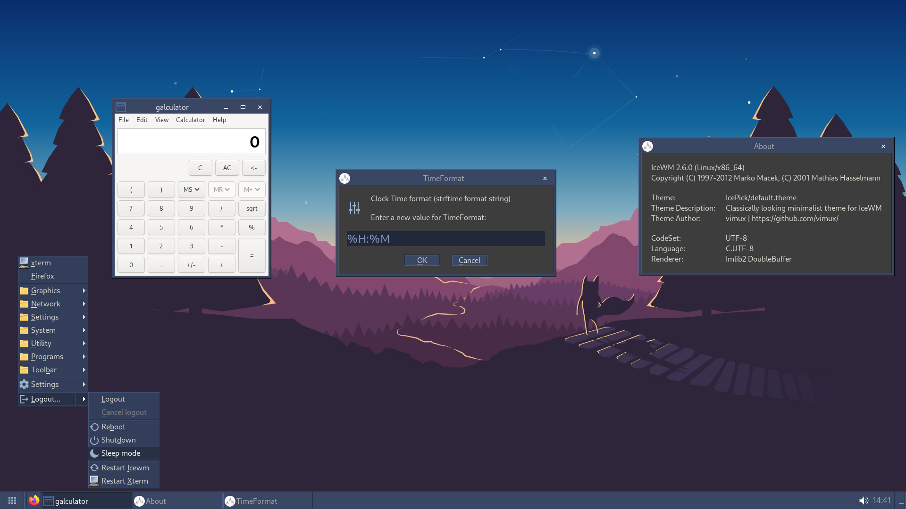

# IcePick

**IcePick** is a classically looking minimalist theme for IceWM.

## Screenshot

**Note**: your look and feel may vary depends on your preferences, available fonts, icons, cursors, GTK theme, etc.

## Quick Start

1. Make a backup. Don't say I didn't warn you!

1. [Download](https://github.com/vimux/icewm-theme-icepick/archive/refs/heads/master.zip) and unzip archive

1. Place `IcePick` theme dir into `~/.icewm/themes/`

1. Copy recommended [preferences](preferences) into `~/.icewm/`

1. Activate theme: **Start (IceWM button) -> Settings -> Themes -> IcePick** \
*Alternatively, use `~/.icewm/theme` file to change the current theme*

## Motivation

About once every few years, I maintained several old PCs with Linux/IceWM on it. The default IceWM theme looked a bit
outdated, so I make my own theme + preferences. Occasionally I even updated a couple of things here and there as per
user requests. Those days are over, old computers replaced, happy end. Anyway, I decided to keep this theme.

I guess no one else will need this in 2021 (or later). Anyway, let it be stored here as a public backup.

## License

This project is released under [GPLv2 license](LICENSE).
